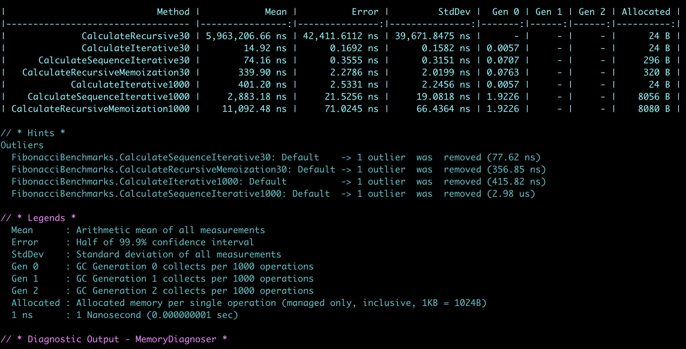
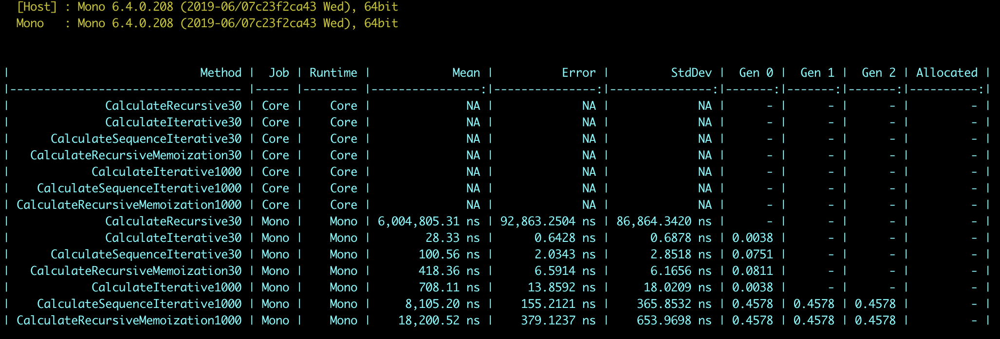

# Algorithims

Benchmark the performance of different algorithm's implementations.

[View project](https://github.com/mariangemarcano/mariangemarcano.github.io/tree/master/projects/C%23/Algorithms)

## Setup

[Install .NET Core](https://microsoft.com/net/core)

## Build

`$ dotnet build`

## Test

Execute `dotnet test`, specifying the test project path.

`$ dotnet test tests/Fibonacci.Tests/Fibonacci.Tests.csproj`

## Benchmark

Execute `$ dotnet run -c RELEASE`, specifying the benchmark project path.
`$ dotnet run -c RELEASE --framework netcoreapp3.0 --project benchmarks/Fibonacci.Benchmarks/Fibonacci.Benchmarks.csproj`

### Output example

# Using mono

## Setup

[Install mono](https://www.mono-project.com/download/stable/)

## Build

`msbuild /p:Configuration=Release Algorithms.sln`

## Benchmark

Execute `$ mono benchmarks/Fibonacci.Benchmarks/bin/Release/net47/Fibonacci.Benchmarks.exe`, specifying the benchmark project path.

### Output example

Mono currently does not expose any api to get the number of allocated bytes. See restrictions: https://benchmarkdotnet.org/articles/configs/diagnosers.html#restrictions

